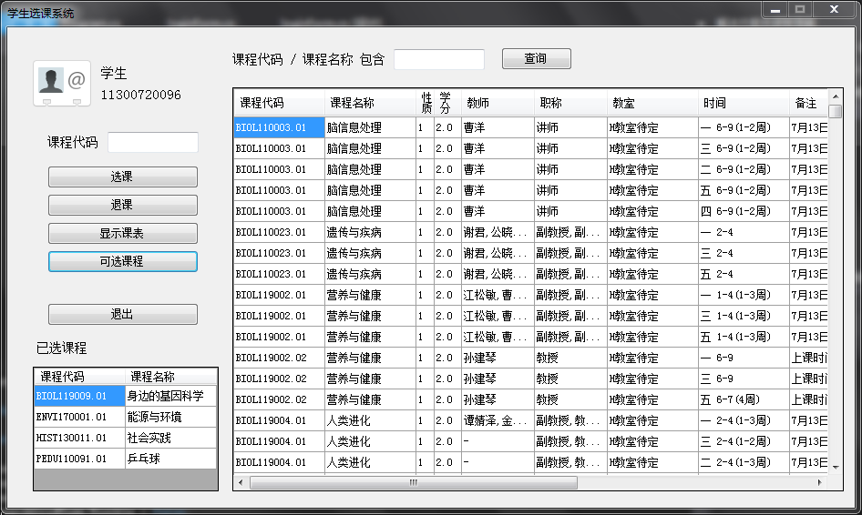
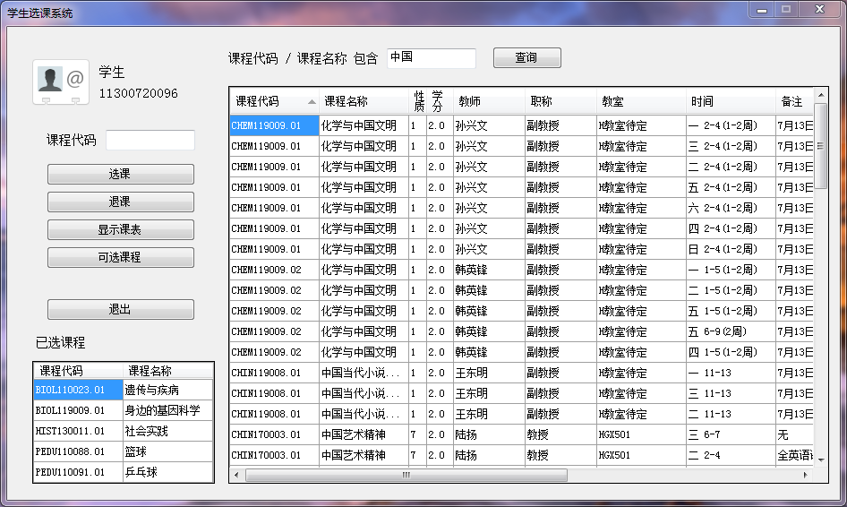
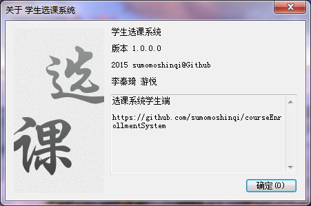

#Course Enrollment System
To use CES, copy `libmysql.dll` and `libmysql.lib` to `C:\Windows\System32` folder.  
Then run CES.exe or CESadmin.exe in `bin` folder.

If you don't have .Net Framwork 4.5 installed, you can download it [here](http://www.microsoft.com/zh-cn/download/details.aspx?id=30653)

To import sample database, use 
```bash
	mysql -u YOURUSERNAME -p YOURPASSWORD Courses < bak.sql
```

Some screenshots  







